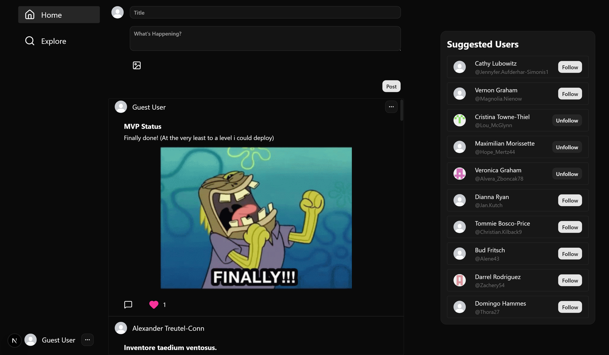

# Nexus 🌐

A full-stack social media web app built using **Next.js (App router)** and **TypeScript**. This app replicates the core functionality of modern social platforms, allowing users to connect, create and interact with content and manage user profiles.



## 🚀 Live Demo

Check it out Live, [HERE!](https://nexus-alpha-pink-39.vercel.app/)

---

## ✨ Features

- **Authentication:** Secure user sign-up, sign-in, and session management.
- **User Profiles:** Personalized profile pages displaying user info, avatar, bio, and user-specific posts, comments and likes.
- **Following/Followers:** Users can follow other users to see their posts on their timeline and gain followers who are interested in their content.
- **Posts and Replies:** Just like Twitter, users can compose posts and replies with full CRUD support (on their own content) allowing them to share their thoughts, ideas, or any other content with their followers.
- **Image Support:** Users can upload images with their posts, replies, profile (user avatar) and enhancing visual content sharing.

---

## ⚙️ Getting Started Locally

### Prerequisites

- Node.js (22+ recommended)
- A Package Manager (pnpm recommended)
- A Supabase account (or local PostgreSQL instance)

### 1. Clone the Repository

```bash
git clone git@github.com:sagar-shrigadi/Nexus.git
cd Nexus
```

### 2. Install Dependencies

```bash
pn i
```

### 3. Environment Variables

Create a .env.local file in the root directory and copy all variables from .env.example file and populate them.

### 4. Run Database Migrations & Seed Data

Migrate/Push the DB schema to Supabase/Local DB and populate the database with mock data using the seed script:

#### Push schema migrations

```bash
pn drizzle-kit migrate
```

#### Seed the database

```bash
pn db:seed
```

### 5. Run the Development Server

```bash
pn dev
```

Visit http://localhost:3000 on your browser.

---

## 🛠️ Tech Stack

- **Framework:** [Next.js 16.2.x+ (App Router)](https://nextjs.org/) with **Server Actions** for backend mutations.
- **Language:** [TypeScript](https://www.typescriptlang.org/) for end-to-end type safety.
- **Database & Storage:** [Supabase](https://supabase.com/) (PostgreSQL & Object Storage for image uploads).
- **ORM:** [Drizzle ORM](https://orm.drizzle.team/) for high-performance, type-safe database queries and migrations.
- **Styling:** [shadcn/ui](https://ui.shadcn.com/) and [Tailwind CSS](https://tailwindcss.com/) for clean, accessible and responsive UI.
- **Authentication:** [NextAuth.js](https://next-auth.js.org/) for Credentials-based authentication.
- **Utilities:** [Faker.js](https://fakerjs.dev/) for database seeding.

---

## 🗄️ Database Architecture


(Image from supabase dashboard Schema Visualizer)

## Table `users`

### Columns

| Name         | Type      | Constraints      |
| ------------ | --------- | ---------------- |
| `id`         | `int4`    | Primary Identity |
| `first_name` | `varchar` |                  |
| `last_name`  | `varchar` |                  |
| `username`   | `varchar` | Unique           |
| `password`   | `text`    |                  |
| `bio`        | `text`    | Nullable         |
| `followers`  | `int4`    |                  |
| `following`  | `int4`    |                  |
| `avatar_id`  | `int4`    | Nullable         |

## Table `avatars`

### Columns

| Name        | Type   | Constraints      |
| ----------- | ------ | ---------------- |
| `id`        | `int4` | Primary Identity |
| `file_name` | `text` | Unique           |
| `publicUrl` | `text` |                  |

## Table `posts`

### Columns

| Name         | Type        | Constraints      |
| ------------ | ----------- | ---------------- |
| `id`         | `int4`      | Primary Identity |
| `title`      | `varchar`   |                  |
| `content`    | `text`      |                  |
| `user_id`    | `int4`      |                  |
| `likes`      | `int4`      |                  |
| `created_at` | `timestamp` |                  |
| `media_id`   | `int4`      | Nullable         |

## Table `posts_likes`

### Columns

| Name         | Type        | Constraints      |
| ------------ | ----------- | ---------------- |
| `id`         | `int4`      | Primary Identity |
| `user_id`    | `int4`      |                  |
| `post_id`    | `int4`      |                  |
| `created_at` | `timestamp` |                  |

## Table `comments`

### Columns

| Name         | Type        | Constraints      |
| ------------ | ----------- | ---------------- |
| `id`         | `int4`      | Primary Identity |
| `content`    | `text`      |                  |
| `created_at` | `timestamp` |                  |
| `user_id`    | `int4`      |                  |
| `post_id`    | `int4`      |                  |
| `likes`      | `int4`      |                  |
| `media_id`   | `int4`      | Nullable         |

## Table `comment_likes`

### Columns

| Name         | Type        | Constraints      |
| ------------ | ----------- | ---------------- |
| `id`         | `int4`      | Primary Identity |
| `user_id`    | `int4`      |                  |
| `comment_id` | `int4`      |                  |
| `post_id`    | `int4`      |                  |
| `created_at` | `timestamp` |                  |

## Table `user_follows`

### Columns

| Name      | Type   | Constraints      |
| --------- | ------ | ---------------- |
| `id`      | `int4` | Primary Identity |
| `user_id` | `int4` |                  |
| `follows` | `int4` |                  |

## Table `media`

### Columns

| Name         | Type   | Constraints      |
| ------------ | ------ | ---------------- |
| `id`         | `int4` | Primary Identity |
| `file_name`  | `text` | Unique           |
| `public_url` | `text` |                  |

---
